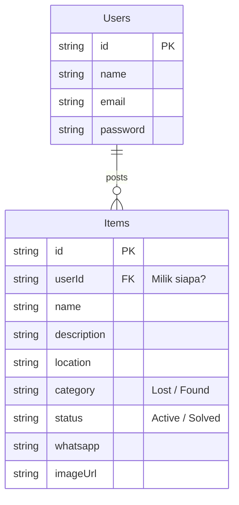

# Lost & Found Application Documentation

Dokumentasi lengkap teknis untuk Aplikasi Lost & Found. Dokumen ini mencakup struktur proyek, analisis sistem (Use Case & ERD), serta justifikasi pemilihan teknologi.

## 1. Project Structure (Struktur Folder)

Berikut adalah struktur direktori utama dari source code aplikasi:

```bash
lost_and_found/
├── backend/                  # SERVER SIDE (Node.js)
│   ├── package.json          # Dependency Node.js
│   └── server.js             # Entry point server & logic API
│
├── lib/                      # CLIENT SIDE (Flutter)
│   ├── models/               # Data Layer
│   │   └── item_model.dart   # Model class untuk Barang (Item)
│   ├── screens/              # UI Layer (Tampilan)
│   │   ├── login_screen.dart # Halaman Login & Register
│   │   ├── home_screen.dart  # Halaman Utama (List & Filter)
│   │   ├── add_item_screen.dart # Form Tambah Barang
│   │   ├── detail_screen.dart   # Tampilan Detail & Kontak WA
│   │   └── my_posts_screen.dart # Halaman Manajemen Postingan User
│   ├── services/             # Service Layer
│   │   └── api_service.dart  # Menangani HTTP Logics (GET, POST, dll)
│   └── main.dart             # Entry point & Routing
├── pubspec.yaml              # Konfigurasi Dependency Flutter
└── README.md                 # Dokumentasi Proyek
```

## 2. System Design

### A. Use Case Diagram
Deskripsi interaksi pengguna dengan sistem:

1.  **Authentication**:
    *   **Register**: Pengguna mendaftar akun baru.
    *   **Login**: Pengguna masuk untuk mengakses fitur penuh.
2.  **Manage Items**:
    *   **View Items**: Melihat daftar barang hilang/ditemukan.
    *   **Filter Items**: Menyaring barang berdasarkan kategori (Lost vs Found).
    *   **Post Item**: Melaporkan barang baru.
    *   **Manage Own Post**: Menghapus atau menandai "Selesai" pada postingan sendiri.
3.  **Interaction**:
    *   **Contact Owner**: Menghubungi pemilik postingan langsung via WhatsApp.

### B. Entity Relationship Diagram (ERD)
Hubungan antar data dalam sistem:



*   **One-to-Many**: Satu User bisa memposting banyak Item.
*   **Foreign Key**: `userId` pada tabel Items merujuk pada `id` pemilik di tabel Users.

## 3. Technology & Justification (Alasan Pemilihan Teknik)

### Backend: Node.js (Express)
Kami memilih **Node.js** sebagai backend server karena alasan berikut:
1.  **JSON Native**: Flutter berkomunikasi menggunakan JSON. Node.js (JavaScript) memproses JSON secara native tanpa perlu konversi berat, membuat API sangat cepat.
2.  **Scalability**: Arsitektur *Non-blocking I/O* Node.js sangat cocok untuk aplikasi yang menangani banyak request bersamaan (seperti banyak user melihat feed barang).
3.  **Efisiensi Development**: Menggunakan bahasa yang dinamis (JS) memungkinkan pembuatan prototype API (CRUD) yang sangat cepat dibandingkan Java/C#.

### Frontend: Flutter
1.  **Cross-Platform**: Satu kode base bisa berjalan di Android dan iOS (bahkan Web/Windows).
2.  **Performance**: Flutter dicompile ke *native ARM code*, sehingga performanya mendekati aplikasi native asli (Java/Swift), jauh lebih cepat dari Hybrid App biasa.
3.  **UI Konsistensi**: Tampilan aplikasi dijamin sama persis di semua jenis HP karena Flutter menggambar setiap pixelnya sendiri.

### Library Pendukung
*   **`http`**: Standar industri di Dart untuk komunikasi jaringan. Ringan dan efisien.
*   **`provider`**: State management yang direkomendasikan Google untuk aplikasi skala kecil-menengah. Memisahkan *Business Logic* dari Login UI.
*   **`shared_preferences`**: Solusi paling efisien untuk menyimpan data kecil (Session Login) secara persisten tanpa membebani memori dengan Database lokal (SQLite/Hive).
*   **`url_launcher`**: Library esensial untuk menjembatani aplikasi dengan ekosistem HP (membuka WhatsApp, Dial Phone, Browser).

## 4. Database Architecture
Sistem ini menggunakan pendekatan **Centralized RESTful Database**:
*   Aplikasi tidak menyimpan data barang di HP pengguna (kecuali cache sementara).
*   Semua data disimpan di Server. Ini memastikan semua pengguna melihat data yang sama secara *Real-Time*.
*   Saat ini environment menggunakan *In-Memory Database* pada Node.js untuk kecepatan demonstrasi, namun struktur sudah siap untuk dihubungkan ke MongoDB/MySQL cukup dengan mengubah 1 file (`server.js`).

## 5. Cara Menjalankan (How to Run)

1.  **Backend**:
    ```bash
    cd backend
    node server.js
    ```
2.  **Mobile App**:
    ```bash
    flutter run
    ```
