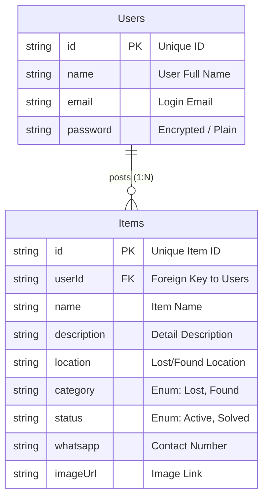

# BAB 1: PENDAHULUAN

## 1.1 Latar Belakang
Kehilangan barang pribadi merupakan kejadian yang sering dialami oleh masyarakat, baik di lingkungan kampus, perkantoran, maupun tempat umum. Seringkali, individu yang menemukan barang (finder) kesulitan untuk mengembalikan barang tersebut kepada pemiliknya (owner) karena ketiadaan informasi kontak yang jelas. Sebaliknya, pemilik barang yang kehilangan juga bingung harus mencari kemana.

Metode konvensional seperti menempelkan poster kehilangan atau bertanya dari mulut ke mulut dinilai kurang efisien dan memiliki jangkauan yang terbatas. Oleh karena itu, diperlukan sebuah solusi berbasis teknologi informasi yang dapat menjembatani antara orang yang kehilangan barang dan orang yang menemukan barang.

## 1.2 Rumusan Masalah
Berdasarkan latar belakang di atas, rumusan masalah dalam pengembangan sistem ini adalah:
1.  Bagaimana membangun aplikasi mobile yang dapat mendata laporan kehilangan dan penemuan barang secara terpusat?
2.  Bagaimana menyediakan fitur komunikasi yang efektif antara penemu dan pemilik barang?
3.  Bagaimana mengelola data laporan agar status barang dapat dipantau (apakah sudah ditemukan atau belum)?

## 1.3 Tujuan
Tujuan dari pengembangan aplikasi "Lost & Found" ini adalah:
1.  Menyediakan platform digital untuk melaporkan barang hilang dan ditemukan dengan mudah dan cepat.
2.  Memudahkan proses pencarian barang melalui fitur filter kategori.
3.  Mempercepat proses pengembalian barang melalui fitur kontak langsung (WhatsApp).

## 1.4 Manfaat
*   **Bagi Pengguna**: Mempermudah pencarian barang hilang dan memberikan rasa aman karena adanya wadah pelaporan yang terstruktur.
*   **Bagi Pengembang**: Menerapkan ilmu pemrograman mobile (Flutter) dan backend (Node.js) dalam studi kasus nyata.

---

# BAB 2: ANALISIS DAN PERANCANGAN SISTEM

## 2.1 Use Case Diagram (Visual)

Berikut adalah visualisasi interaksi aktor dengan sistem menggunakan Mermaid Diagram:

```mermaid
usecaseDiagram
    actor "User (Guest)" as G
    actor "User (Member)" as M
    
    package "Lost & Found System" {
        usecase "Register" as U1
        usecase "Login" as U2
        usecase "View & Filter Items" as U3
        usecase "Post Item" as U4
        usecase "Manage Own Post" as U5
        usecase "Contact via WhatsApp" as U6
    }

    G --> U1
    G --> U2
    
    M --> U3
    M --> U4
    M --> U5
    M --> U6
    
    U1 -.-> U2 : <<include>>
```

## 2.2 Tabel Deskripsi Use Case (Detail)

Berikut adalah data terperinci untuk setiap use case:

#### 1. Use Case: Registrasi & Login
| Komponen | Deskripsi |
| :--- | :--- |
| **Aktor** | User (Guest) |
| **Tujuan** | Masuk ke dalam sistem untuk mendapatkan akses penuh fitur. |
| **Kondisi Awal** | Aplikasi terbuka, User belum login. |
| **Skenario Utama** | 1. User memilih menu "Daftar Akun Baru".<br>2. User mengisi Nama, Email, dan Password.<br>3. Sistem memvalidasi dan menyimpan data.<br>4. User melakukan Login dengan email yang terdaftar.<br>5. Sistem memberikan akses ke Halaman Utama. |
| **Kondisi Akhir** | User berhasil masuk dan sesi tersimpan. |

#### 2. Use Case: Melihat & Filter Barang
| Komponen | Deskripsi |
| :--- | :--- |
| **Aktor** | User (Member) |
| **Tujuan** | Mencari barang berdasarkan kategori spesifik. |
| **Kondisi Awal** | User sudah login dan berada di Dashboard. |
| **Skenario Utama** | 1. Sistem menampilkan semua daftar barang secara default.<br>2. User menekan tombol filter "Hilang" atau "Ditemukan".<br>3. Sistem menyaring daftar barang sesuai kategori yang dipilih.<br>4. User melihat detail barang yang sesuai. |
| **Kondisi Akhir** | Daftar barang terfilter sesuai keinginan User. |

#### 3. Use Case: Menambah Laporan (Post Item)
| Komponen | Deskripsi |
| :--- | :--- |
| **Aktor** | User (Member) |
| **Tujuan** | Melaporkan barang yang hilang atau ditemukan. |
| **Kondisi Awal** | User menekan tombol tambah (+). |
| **Skenario Utama** | 1. User mengisi form: Nama Barang, Deskripsi, Lokasi, Kategori, No WA, Foto.<br>2. User menekan tombol "Simpan".<br>3. Sistem mengirim data ke server.<br>4. Sistem menampilkan notifikasi sukses dan kembali ke Dashboard. |
| **Kondisi Akhir** | Data barang baru muncul di halaman utama. |

#### 4. Use Case: Menghubungi Via WhatsApp
| Komponen | Deskripsi |
| :--- | :--- |
| **Aktor** | User (Member) |
| **Tujuan** | Berkomunikasi dengan pelapor barang untuk koordinasi pengembalian. |
| **Kondisi Awal** | User membuka halaman Detail Barang. |
| **Skenario Utama** | 1. User membaca detail barang.<br>2. User menekan tombol "Hubungi via WhatsApp".<br>3. Sistem membuka aplikasi WhatsApp dengan pesan template otomatis.<br>4. User mengirim pesan ke pelapor. |
| **Kondisi Akhir** | Percakapan terjadi di WhatsApp. |

#### 5. Use Case: Manajemen Postingan Sendiri
| Komponen | Deskripsi |
| :--- | :--- |
| **Aktor** | User (Pemilik Postingan) |
| **Tujuan** | Mengupdate status barang atau menghapus laporan. |
| **Kondisi Awal** | User membuka menu "Postingan Saya". |
| **Skenario Utama** | 1. User memilih salah satu postingan miliknya.<br>2. User memilih opsi "Tandai Selesai" atau "Hapus".<br>3. Sistem memperbarui status atau menghapus data dari database.<br>4. Daftar postingan diperbarui. |
| **Kondisi Akhir** | Status barang berubah atau data terhapus. |

---

## 2.3 Entity Relationship Diagram (ERD)



---

# BAB 3: ARSITEKTUR PERANGKAT LUNAK

## 3.1 Struktur Proyek (Directory Structure)
Pengembangan aplikasi menerapkan prinsip **Separation of Concerns** dengan memisahkan kode Frontend dan Backend.

```
LostAndFound_Project/
├── backend/                  # Sisi Server (Backend)
│   ├── server.js             # Logika utama API dan Server
│   └── package.json          # Manajemen dependensi server
│
├── lib/                      # Sisi Klien (Mobile App Flutter)
│   ├── models/               # Representasi Data
│   │   └── item_model.dart   # Class Object untuk Barang
│   ├── services/             # Komunikasi Data
│   │   └── api_service.dart  # Menangani Request HTTP ke Backend
│   ├── screens/              # Tampilan Antarmuka (UI)
│   │   ├── login_screen.dart # Halaman Otentikasi
│   │   ├── home_screen.dart  # Halaman Utama & Filter
│   │   ├── add_item_screen.dart # Form Input Barang
│   │   └── detail_screen.dart   # Detail Barang & Action Button
│   └── main.dart             # Entry point aplikasi
```

## 3.2 Alur Komunikasi Data (RESTful Architecture)
Sistem menggunakan arsitektur **Client-Server** dengan protokol **HTTP/REST**.

1.  **Request**: Aplikasi Flutter (Client) mengirim permintaan HTTP (GET, POST, PUT, DELETE) ke URL endpoint Server (misal: `POST /items`). Data dikirim dalam format **JSON**.
2.  **Processing**: Node.js Server menerima permintaan, memproses logika (validasi, simpan data), dan berinteraksi dengan Database.
3.  **Response**: Server mengembalikan respon ke Aplikasi dalam format JSON beserta **HTTP Status Code** (200 OK, 201 Created, 401 Unauthorized).
4.  **UI Update**: Aplikasi Flutter menerima data JSON dan memperbarui tampilan layar menggunakan `setState()` atau state management.

---

# BAB 4: IMPLEMENTASI TEKNOLOGI

## 4.1 Teknologi Backend (Node.js)
Backend dibangun menggunakan **Node.js** karena arsitekturnya yang non-blocking dan efisien menangani banyak permintaan I/O.
*   **Framework**: Express.js digunakan untuk mempermudah routing API.
*   **Data Handling**: Body-Parser digunakan untuk membaca input JSON dari Flutter.
*   **CORS**: Diaktifkan untuk mengizinkan akses dari berbagai origin (termasuk Emulator Android).

## 4.2 Teknologi Frontend (Flutter)
Frontend dibangun menggunakan **Flutter** (bahasa Dart).
*   **Widget Tree**: Seluruh tampilan dibangun dari komposisi Widget (Scaffold, Column, ListView, Card).
*   **Asynchronous Programming**: Menggunakan `Future` dan `async/await` untuk memastikan aplikasi tidak macet (freeze) saat mengambil data dari server.
*   **Responsive Layout**: Menggunakan `ListView.builder` dan `Expanded` agar tampilan tetap rapi di berbagai ukuran layar.

## 4.3 Library dan Dependensi
Berikut adalah pustaka eksternal yang digunakan dalam `pubspec.yaml`:

| Library | Fungsi Utama |
| :--- | :--- |
| **http** | Melakukan HTTP Request ke Node.js server. |
| **shared_preferences** | Menyimpan data sesi login (session persistence) di memori lokal HP. |
| **url_launcher** | Membuka aplikasi eksternal (WhatsApp) dari dalam aplikasi. |
| **google_fonts** | Menyediakan font "Poppins" untuk estetika UI. |
| **provider** | (Opsional) Manajemen state untuk distribusi data user. |

---

# BAB 5: PENUTUP DAN PANDUAN PENGGUNAAN

Aplikasi "Lost & Found" telah berhasil dikembangkan dengan fitur CRUD lengkap yang terintegrasi antara aplikasi seluler Flutter dan server Node.js. Sistem mampu menangani pelaporan barang secara real-time dan memfasilitasi komunikasi antar pengguna.

**Panduan Menjalankan Sistem:**

1.  **Persiapan Server**:
    *   Buka terminal di folder `backend`.
    *   Jalankan perintah `node server.js`.
    *   Server aktif di `http://localhost:3000`.

2.  **Persiapan Aplikasi**:
    *   Pastikan Emulator Android aktif.
    *   Buka terminal di folder root proyek.
    *   Jalankan perintah `flutter run`.

3.  **Penggunaan**:
    *   Lakukan **Registrasi** akun baru pada halaman awal.
    *   Gunakan akun tersebut untuk **Login**.
    *   Akses halaman utama untuk memposting atau mencari barang hilang.
